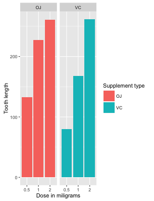

# Statistical Inference Course Project, Part 2: Basic Inferential Analysis


In the second part of the project, we analyze the `ToothGrowth` data in the R
datasets package. The data is set of 60 observations, length of odontoblasts
(teeth) in each of 10 guinea pigs at each of three dose levels of Vitamin C
(0.5, 1 and 2 mg) with each of two delivery methods (orange juice or ascorbic
acid).

```{r}
library(datasets)
library(ggplot2)
ggplot(data=ToothGrowth, aes(x=as.factor(dose), y=len, fill=supp)) +
    geom_bar(stat="identity",) +
    facet_grid(. ~ supp) +
    xlab("Dose in miligrams") +
    ylab("Tooth length") +
    guides(fill=guide_legend(title="Supplement type"))
```
 


As can be seen above, there is a clear positive correlation between the
tooth length and the dose levels of Vitamin C, for both delivery methods.

The effect of the dose can also be identified using regression analysis. One
interesting question that can also be addressed is whether the supplement type
(i.e. orange juice or ascorbic acid) has any effect on the tooth length. In other
words, how much of the variance in tooth length, if any, can be explained by
the supplement type?


```{r}
fit <- lm(len ~ dose + supp, data=ToothGrowth)
summary(fit)
```

The model explains 70% of the variance in the data.
The intercept is `r fit$coefficients[[1]]`, meaning that with no supplement of
Vitamin C, the average tooth length is `r fit$coefficients[[1]]` units. The
coefficient of `dose` is `r fit$coefficients[[2]]`. It can be interpreted as
increasing the delievered dose 1 mg, all else equal (i.e. no change in the
supplement type), would increase the tooth length `r fit$coefficients[[2]]` units.
The last coefficient is for the supplement type. Since the supplement type is
a categorical variable, dummy variables are used. The computed coefficient
is for `suppVC` and the value is `r fit$coefficients[[3]]` meaning that delivering
a given dose as ascorbic acid, without changing the dose, would result in
`r abs(fit$coefficients[[3]])` units of decrease in the tooth length. Since there
are only two categories, we can also conclude that on average, delivering the dosage as
orange juice would increase the tooth length by `r abs(fit$coefficients[[3]])` units.

95% confidence intervals for two variables and the intercept are as follows.
```{r}
confint(fit)
```
The confidence intervals mean that if we collect a different set of data and
estimate parameters of the linear model many times, 95% of the time, the
coefficient estimations will be in these ranges. For each coefficient (i.e.
intercept, `dose` and `suppVC`), the null hypothesis is that the coefficients are
zero, meaning that no tooth length variation is explained by that variable.
All _p_-values are less than 0.05, rejecting the null hypothesis and suggesting
that each variable explains a significant portion of variability in tooth length,
assuming the significance level is 5%.
